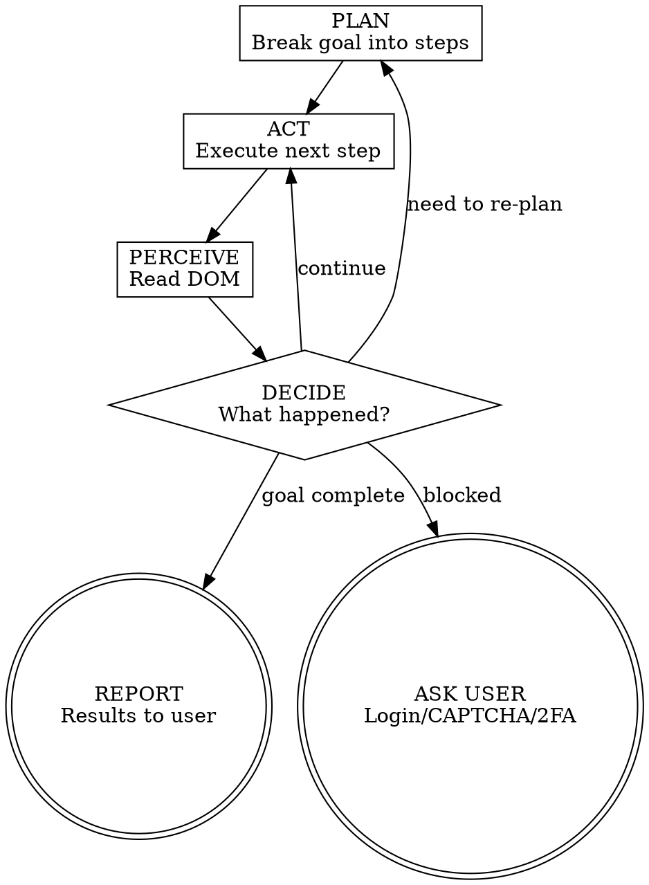

# Chrome CDP Browser Control

Control Chrome directly via the Chrome DevTools Protocol. No Playwright, no MCP — raw CDP through a CLI helper.

## Quick Reference

All commands use the helper at `~/.claude/skills/chrome-cdp/cdp.js`:

| Command | Purpose |
|---------|---------|
| `node cdp.js launch` | Launch Chrome with debugging (or connect if running) |
| `node cdp.js navigate <url>` | Go to URL, wait for load |
| `node cdp.js dom` | Get compact DOM (~4000 chars) |
| `node cdp.js dom <selector>` | Get DOM subtree |
| `node cdp.js dom --full` | Get full DOM (no truncation) |
| `node cdp.js screenshot` | Save screenshot to /tmp/cdp-screenshot.png |
| `node cdp.js click <selector>` | Click element |
| `node cdp.js type <selector> <text>` | Type into input |
| `node cdp.js press <key>` | Press key (Enter, Tab, Escape, etc.) |
| `node cdp.js scroll <up\|down>` | Scroll page |
| `node cdp.js eval <js>` | Run JavaScript in page |
| `node cdp.js tabs` | List open tabs |
| `node cdp.js tab <id>` | Switch tab |
| `node cdp.js close` | Close current tab |

## The Perceive-Act Loop

When given a goal, follow this loop:



### Step by Step

1. **PLAN** — Break the user's goal into high-level steps. Think about what site to visit, what actions to take, what information to extract.

2. **ACT** — Run the next cdp.js command (navigate, click, type, etc.)

3. **PERCEIVE** — Run `node cdp.js dom` to read the page. This is mandatory after every action. Never chain actions without perceiving.

4. **DECIDE** — Based on the DOM:
   - Expected state? Proceed to next action.
   - Login wall / CAPTCHA / 2FA? Stop and tell the user.
   - Unexpected content? Re-plan.
   - Goal complete? Report results.

5. **REPEAT** until goal is achieved or you're blocked.

## Rules

<HARD-RULES>

1. **Always perceive after acting.** Never execute two actions without reading the DOM between them. Every click, type, or navigate MUST be followed by `dom`.

2. **DOM before screenshot.** Always try `dom` first. Only use `screenshot` if DOM output is empty/insufficient (canvas apps, image-heavy layouts).

3. **Report actual content.** When the goal is information retrieval, extract and present the actual text from the page. Do not summarize what you think is there — show what IS there.

4. **Stop when blocked.** If you encounter a login wall, CAPTCHA, 2FA prompt, or cookie consent that blocks progress, tell the user. Do not guess credentials or attempt to bypass security.

5. **Wait for dynamic content.** After navigation or clicks that trigger page loads, use `eval document.readyState` or check for specific elements before reading DOM.

6. **Use CSS selectors for targeting.** When you need to click or type into a specific element, identify it from the DOM output using CSS selectors (id, class, aria-label, data-testid, or structural selectors).

</HARD-RULES>

## Getting Started

```bash
# First time: launch Chrome
node ~/.claude/skills/chrome-cdp/cdp.js launch

# If user already has Chrome open with debugging:
node ~/.claude/skills/chrome-cdp/cdp.js connect
```

If Chrome is not running with debugging enabled, `launch` will start a new instance. If already running on port 9222, it connects to the existing instance.

The user can also start Chrome manually:
```bash
/Applications/Google\ Chrome.app/Contents/MacOS/Google\ Chrome --remote-debugging-port=9222
```

## Token Efficiency

The `dom` command returns a compact representation:
- Scripts, styles, SVGs, hidden elements are stripped
- Only interactive and structural tags are shown with their attributes
- Whitespace is collapsed
- Output is truncated to ~4000 chars by default

Use `dom <selector>` to scope to a specific part of the page when you know where to look. This saves significant tokens on large pages.

Use `--full` only when you need the complete DOM (rare).

## Finding Elements

Read the DOM output and identify elements by:
1. **id**: `#search-input` — most reliable
2. **data-testid**: `[data-testid="submit-btn"]`
3. **aria-label**: `[aria-label="Search"]`
4. **class**: `.nav-link`
5. **structural**: `form input[type="email"]`
6. **text-based** (via eval): `node cdp.js eval "document.querySelector('button').textContent"`

If a CSS selector doesn't work, use `eval` to find elements by text content:
```bash
node cdp.js eval "
  [...document.querySelectorAll('a')]
    .find(a => a.textContent.includes('Sign in'))
    ?.getAttribute('href')
"
```

## Common Patterns

**Navigate and read:**
```bash
node cdp.js navigate https://news.ycombinator.com
node cdp.js dom
```

**Fill a form:**
```bash
node cdp.js click input[name="q"]
node cdp.js type input[name="q"] "search query"
node cdp.js press Enter
node cdp.js dom
```

**Handle dynamic content:**
```bash
node cdp.js click .load-more-btn
node cdp.js eval "document.querySelectorAll('.item').length"  # Wait for items
node cdp.js dom .results-container
```
