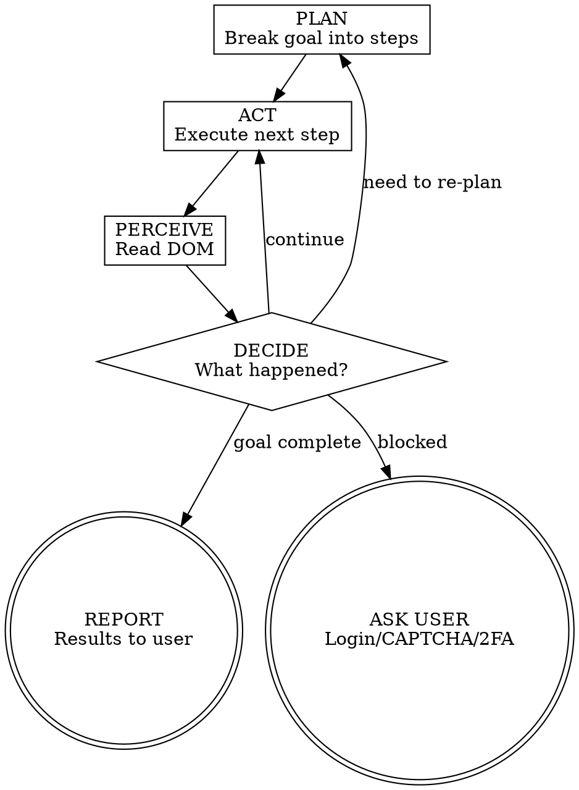

# Chrome CDP Browser Control

Control Chrome directly via the Chrome DevTools Protocol. No Playwright, no MCP — raw CDP through a CLI helper.

## How to Run Commands

All commands use `cdp.js` from this skill's base directory. The base directory is provided when the skill loads — use it as the path prefix.

### Session Setup (once per session)

1. **Launch Chrome** using a direct CLI command:
   ```bash
   node <base-dir>/cdp.js launch
   ```
2. **Capture the session ID and command file path** from the output. It prints `Session: <id>` and `Command file: <path>`. Save both — you'll use them for all subsequent commands.

### Running Commands (repeats)

For all commands after launch, use two steps:

1. **Write** the command to the session's command file (the path printed by launch) using the Write tool:
   ```
   Write to <command-file-path>:
   {"command": "navigate", "args": ["https://example.com"]}
   ```

2. **Execute** with a fixed bash command (same every time for this session):
   ```bash
   node <base-dir>/cdp.js run <sessionId>
   ```

Because the bash command is identical every invocation, the user only approves it once.

### Command Reference

| Command | args | Example JSON |
|---------|------|-------------|
| `navigate` | `["<url>"]` | `{"command": "navigate", "args": ["https://example.com"]}` |
| `dom` | `[]` or `["<selector>"]` or `["--full"]` | `{"command": "dom", "args": []}` |
| `screenshot` | none | `{"command": "screenshot", "args": []}` |
| `click` | `["<selector>"]` | `{"command": "click", "args": ["button.submit"]}` |
| `doubleclick` | `["<selector>"]` | `{"command": "doubleclick", "args": ["td.cell"]}` |
| `hover` | `["<selector>"]` | `{"command": "hover", "args": [".menu-trigger"]}` |
| `focus` | `["<selector>"]` | `{"command": "focus", "args": ["input[name=q]"]}` |
| `type` | `["<selector>", "<text>"]` | `{"command": "type", "args": ["input[name=q]", "search query"]}` |
| `keyboard` | `["<text>"]` | `{"command": "keyboard", "args": ["hello world"]}` |
| `select` | `["<selector>", "<value>"]` | `{"command": "select", "args": ["select#country", "US"]}` |
| `upload` | `["<selector>", "<path>"]` | `{"command": "upload", "args": ["input[type=file]", "/tmp/photo.png"]}` |
| `drag` | `["<from>", "<to>"]` | `{"command": "drag", "args": [".card:first-child", ".dropzone"]}` |
| `dialog` | `["accept"]` or `["dismiss"]` or `["accept", "<text>"]` | `{"command": "dialog", "args": ["accept"]}` |
| `waitfor` | `["<selector>"]` or `["<selector>", "<ms>"]` | `{"command": "waitfor", "args": [".dropdown", "5000"]}` |
| `waitfornav` | `[]` or `["<ms>"]` | `{"command": "waitfornav", "args": ["5000"]}` |
| `press` | `["<key>"]` | `{"command": "press", "args": ["Enter"]}` |
| `scroll` | `["up"]` or `["down"]` | `{"command": "scroll", "args": ["down"]}` |
| `eval` | `["<js>"]` | `{"command": "eval", "args": ["document.title"]}` |
| `tabs` | none | `{"command": "tabs", "args": []}` |
| `tab` | `["<id>"]` | `{"command": "tab", "args": ["ABC123"]}` |
| `newtab` | `[]` or `["<url>"]` | `{"command": "newtab", "args": ["https://example.com"]}` |
| `close` | none | `{"command": "close", "args": []}` |

**Important:** The `args` array maps directly to command-line arguments. For `type`, the first arg is the selector and the second is the text. For `eval`, pass the entire expression as a single string in `args[0]`.

**`type` vs `keyboard`:** Use `type` when you need to focus a specific input and fill it. Use `keyboard` when you need to type at the current caret position — essential for rich text editors (Slack, Google Docs, Notion) where re-focusing the container resets the cursor. A typical flow for @mentions: `click` the editor, `keyboard` to type `@name`, `waitfor` the autocomplete dropdown, then `click` the match.

**`click` behavior:** `click` automatically waits up to 5s for the element to appear and scrolls it into view before clicking. No need to add manual waits before clicking dynamically-rendered elements like autocomplete dropdowns.

**`waitfor` behavior:** Blocks until the selector matches an element in the DOM, then prints its tag and text content. Exits with an error if the timeout expires (default 5000ms).

### Tab Isolation

Each session creates and owns its own tabs. Sessions never reuse tabs from other sessions or pre-existing tabs.

- `launch`/`connect` creates a **new blank tab** for the session
- `newtab` opens an additional tab within the session
- `tabs` only lists tabs owned by the current session
- `tab <id>` only switches to session-owned tabs
- `close` removes the tab from the session

This means two agents can work side by side in the same Chrome instance without interfering with each other.

## The Perceive-Act Loop

When given a goal, follow this loop:



### Step by Step

1. **PLAN** — Break the user's goal into high-level steps. Think about what site to visit, what actions to take, what information to extract.

2. **ACT** — Write the command JSON, then run `node <base-dir>/cdp.js run <sessionId>`.

3. **PERCEIVE** — Write `{"command": "dom", "args": []}` and run. This is mandatory after every action. Never chain actions without perceiving.

4. **DECIDE** — Based on the DOM:
   - Expected state? Proceed to next action.
   - Login wall / CAPTCHA / 2FA? Stop and tell the user.
   - Unexpected content? Re-plan.
   - Goal complete? Report results.

5. **REPEAT** until goal is achieved or you're blocked.

## Rules

<HARD-RULES>

1. **Always perceive after acting.** Never execute two actions without reading the DOM between them. Every click, type, or navigate MUST be followed by `dom`.

2. **DOM before screenshot.** Always try `dom` first. Only use `screenshot` if DOM output is empty/insufficient (canvas apps, image-heavy layouts).

3. **Report actual content.** When the goal is information retrieval, extract and present the actual text from the page. Do not summarize what you think is there — show what IS there.

4. **Stop when blocked.** If you encounter a login wall, CAPTCHA, 2FA prompt, or cookie consent that blocks progress, tell the user. Do not guess credentials or attempt to bypass security.

5. **Wait for dynamic content.** After navigation or clicks that trigger page loads, use `eval document.readyState` or check for specific elements before reading DOM.

6. **Use CSS selectors for targeting.** When you need to click or type into a specific element, identify it from the DOM output using CSS selectors (id, class, aria-label, data-testid, or structural selectors).

</HARD-RULES>

## Getting Started

**Important:** Before first use, install dependencies: `cd <base-dir> && npm install`

```bash
# Launch Chrome and get a session ID
node <base-dir>/cdp.js launch
# Output includes: Session: a1b2c3d4
#                  Port: 52431
#                  Command file: /tmp/cdp-command-a1b2c3d4.json  (path varies by OS)
```

If Chrome is not running with debugging enabled, `launch` will start a new instance on an automatically discovered free port. The port is printed in the output and saved in the session state — all subsequent `run` commands use it automatically.

To force a specific port, set `CDP_PORT`:
```bash
CDP_PORT=9222 node <base-dir>/cdp.js launch
```

The user can also start Chrome manually and specify the port:
```bash
/Applications/Google\ Chrome.app/Contents/MacOS/Google\ Chrome --remote-debugging-port=9222
# Then launch with:
CDP_PORT=9222 node <base-dir>/cdp.js launch
```

## Token Efficiency

The `dom` command returns a compact representation:
- Scripts, styles, SVGs, hidden elements are stripped
- Only interactive and structural tags are shown with their attributes
- Whitespace is collapsed
- Output is truncated to ~4000 chars by default

Use `dom <selector>` to scope to a specific part of the page when you know where to look. This saves significant tokens on large pages.

Use `--full` only when you need the complete DOM (rare).

## Finding Elements

Read the DOM output and identify elements by:
1. **id**: `#search-input` — most reliable
2. **data-testid**: `[data-testid="submit-btn"]`
3. **aria-label**: `[aria-label="Search"]`
4. **class**: `.nav-link`
5. **structural**: `form input[type="email"]`
6. **text-based** (via eval): use eval with `document.querySelector('button').textContent`

If a CSS selector doesn't work, use `eval` to find elements by text content:
```json
{"command": "eval", "args": ["[...document.querySelectorAll('a')].find(a => a.textContent.includes('Sign in'))?.getAttribute('href')"]}
```

## Common Patterns

All examples below assume you've already launched and have a session ID. For each command: write the JSON to the command file path (printed by launch), then `node <base-dir>/cdp.js run <sessionId>`.

**Navigate and read:**
```json
{"command": "navigate", "args": ["https://news.ycombinator.com"]}
```
```json
{"command": "dom", "args": []}
```

**Fill a form:**
```json
{"command": "click", "args": ["input[name=q]"]}
```
```json
{"command": "type", "args": ["input[name=q]", "search query"]}
```
```json
{"command": "press", "args": ["Enter"]}
```
```json
{"command": "dom", "args": []}
```

**Handle dynamic content:**
```json
{"command": "click", "args": [".load-more-btn"]}
```
```json
{"command": "eval", "args": ["document.querySelectorAll('.item').length"]}
```
```json
{"command": "dom", "args": [".results-container"]}
```

**Rich text editors and @mentions:**
```json
{"command": "click", "args": [".ql-editor"]}
```
```json
{"command": "keyboard", "args": ["Hello "]}
```
```json
{"command": "keyboard", "args": ["@alice"]}
```
```json
{"command": "waitfor", "args": ["[data-qa='tab_complete_ui_item']", "5000"]}
```
```json
{"command": "click", "args": ["[data-qa='tab_complete_ui_item']"]}
```
```json
{"command": "keyboard", "args": [" check this out"]}
```
